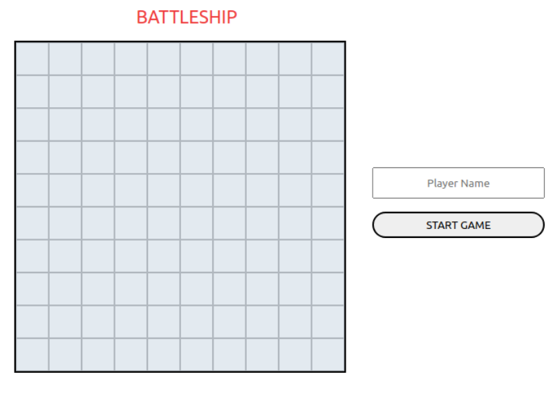
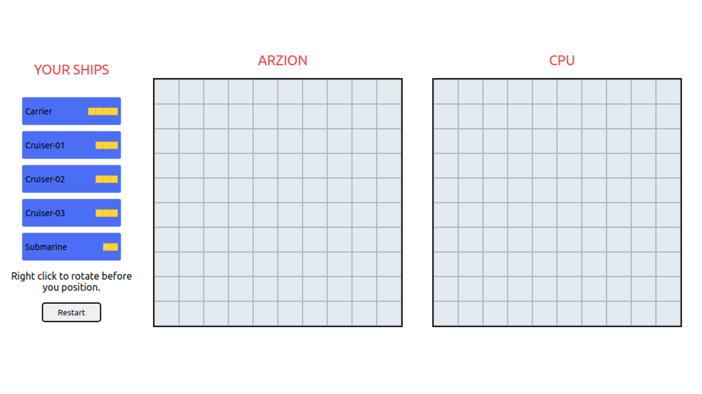
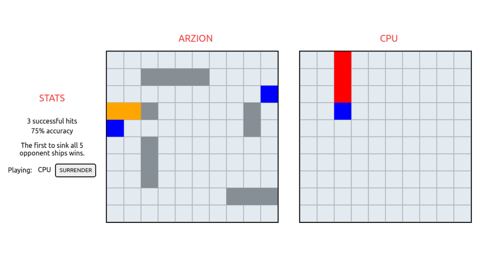
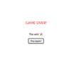

<div align="center">
  <h1 align="center">BATTLESHIP</h1>
</div>

<div align="center">
  <h3>START SCREEN</h3>
  
</div>  

<div align="center">
  <h3>GAME SCREEN</h3>


  
</div  >

<div align="center">
  <h3>END GAME SCREEN</h3>
  
</div  >


<!-- ABOUT THE PROJECT -->

## About The Project
The classic game of  <a href="https://en.wikipedia.org/wiki/Battleship_(game)">BATTLESHIP  </a>


<!-- GETTING STARTED -->
## Getting Started 


### Requirements:

 * __Node__: ^14.17.6
 * __NPM__: ^6.14.16 
 

### Installation:

1. Clone the repo


```sh
git clone https://github.com/LavalAlex/battleship.git
```


2. Install NPM packages

* client folder

```sh
npm install
```


### Testing:

  * run test

```sh
npm run test
```
