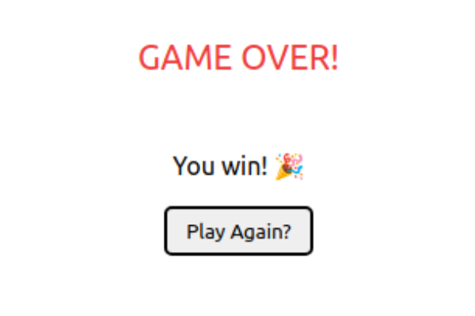

<div align="center">
  <h1 align="center">BATTLESHIP</h1>
</div>

<br />

<div align="center">
  <h3>START SCREEN</h3>
  
</div>  
<br/>

<div align="center">
  <h3>GAME SCREEN</h3>
</div>
<div>
  


 
  
  
</div>
<div align="center">
  <h3>END GAME SCREEN</h3>
  
</div>
<br/>

 


<!-- ABOUT THE PROJECT -->
## ABOUT THE PROJECT 
The classic game of BATTLESHIP


<br />
<!-- GETTING STARTED -->
## GETTING STARTED 


### Requirements:

 * __Node__: ^14.17.6
 * __NPM__: ^6.14.16 
 

### Installation:

1. Clone the repo


```sh
git clone https://github.com/LavalAlex/battleship.git
```


2. Install NPM packages

* client folder

```sh
npm install
```

<br />

